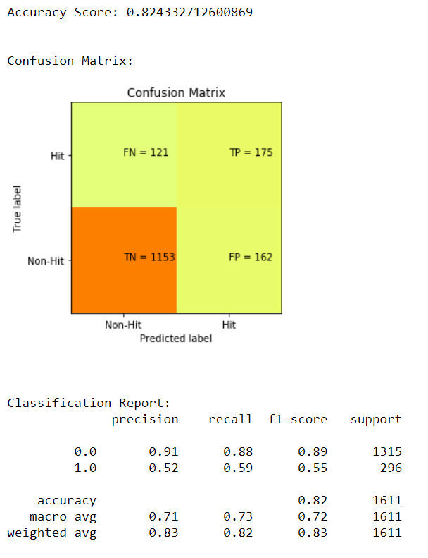

# Video Game Hit Prediction

The video game industry is growing at an unprecedented rate. Handheld mobile games, PC Gaming accessibility, and virtual reality have all helped bring what was once a small, niche industry into the mainstream media. Tens of thousands of games are released each year, some by small independent publishers, and others by massive, triple A studios. 

Now more than ever it is important to be able to predict if a game will sell well or not. Developers are under increasing pressure to hit deadlines and download targets. At the same time, users and critics alike have never been tougher on evaluating and rating the video games that they play. 

## Problem Statement: Is it possible to build a model that will predict whether or not a game will be a "hit" using critic and user scores, revenue, and categorical features?

## Data Source Overview

This data pulled from two very separate data sources and attempted to pull them together. 

### 1. VGChartz.com web-scraped data

* This data was pulled using beautiful soup in early 2019. In order to replicate the pull, I found a script written by a fellow gaming programmer that was updated in early 2016. SOURCE: https://github.com/ashaheedq/vgchartzScrape
* I downloaded and modified this script, ensuring that I could run it myself and updating it for a few additional features I wanted to scrape.
* While ultimately I didn't end up using my own script to form the data, I successfully created a partial file that tested if my modified API script worked.
* My modified version of this script is included in a folder in this repository. 
* The script pulled roughly 20,000 records of games released in the past 35 years

* This data primarily contained the following information that would be used in modeling
* Sales info: Global and regional
* Critic and user score: Average score given by all critics and users
* Year of Release
* Categorical Information: Platform, Genre, Publisher

### 2. Steamdb.info, SteamAPI, and SteamSpy web-scraped data

* This data was pulled using a method unbeknownst to me and undocumented in the data source.
* It combines information about PC video games hosted on Steam: a massive video game launcher
* SteamSpy is a website which constantly updates using Steam's API to show how many people own a game and how many people have played a game
* SteamSpy does not have a publically available API
* Steamdb.info is a similar service which tracks how many players are currently playing a game. This is a very difficult website to download any sort of information from, and they even state that they did not build an API so people would not be able to use their website for profit and individual projects. 
* Luckily, someone much smarter than me figured out how to combine all of this data in a webscrape done near the end of 2016
* The dataset contains roughly 15,000 steam games released in the past 25 years

## Scrubbing and Updating the Data

Before I even began analysis on this data, I had to do a significant amount of work to get it into EDA shape. The 2019 vgchartz data that I had scraped was incomplete in many areas, so dealing with null values was a pain. Luckily I found an older pull of a similar vgchartz script from 2016 that had a pristine pull. Nearly no data was missing from the vgchartz scrape up through 2016. As such, I combined the complete, clean 2016 dataset with the 2019 dataset I scraped. This was an obstacle because I was unsure of which sales numbers to use for 2015/2016, should I use the clean 2016 numbers? Or the slightly less clean updated 2019 numbers. I settled on updating 2016 sales numbers with 2019 figures, but for all data before the year 2016 I would use the cleaner 2016 data.

## Exploratory Data Analysis

As I entered this project, I knew EDA was going to be a key aspect of my project. 20,000 games is not a ton to work with, and I was particularly interested in the "Console War" between Nintendo, Sony, and Microsoft. I knew that gaining insight into these issues with hit detection machine learning would be difficult, so I focused much of my project time on creating effective visuals and organizing information in a way that allowed me to compare the performance of consoles against each other. 

### Establishing what a "Hit" was. 

In order to do classification and modeling, I needed to establish which games were "hits" according to the sales data. I settled somewhat arbitrarily on 1 million units, because it was roughly around the 90% of the data, and it was a nice round number to discuss with a non-technical audience. 

For all games, I classified them as "Hit" if they sold over 1 million copies, or "Not-Hit" if they failed to reach that marker. 

### Exploring by Genre, Platform, Year, and Regionality

I learned a lot about the history of games and how it has changed recently through this analysis. 
Below are a few key visuals for each category, and below that is a summary of key findings through EDA

* The PS2 has been the dominant console force for the last two decades. PS3 and PS4 are also in the top 5, a great showing by Sony. 

### Console War Summary

Much of the EDA process was spent pitting consoles against each other in various metrics. Ultimately, Sony performed the best particularly with the PS2 and the PS4, but Microsoft did well with their XBox 360 and Nintendo is making it's way back into the competition with the rise of the Switch. 

### About Text NLP EDA

In addition to looking at numeric and categorical features in the datasets, I was also curious if there was any correlation between the description of a game and whether or not that game was successful. As part of EDA, I created a list of top words used in successful and failed games and compared them against one another. I also created some word clouds.

## Modeling

### Modeling Part 1: VGChartz data hit prediction

As I began modeling, I first ran vanilla machine learning classifiers. I ran 8 machine learning algorithms and compared their training and validation accuracies to determine which would be the best models. 

Because I used global_sales to determine what was a hit, all of the sales figures became too highly correlated with the target variable to be useful in machine learning. For this reason, I was left with only 4 continuous variables to work with.

* User Count
* User Score
* Critic Score
* Critic Count
* Year (pseudo numerical)

The other variables I had to use were categorical...

* Genre
* Platform
* Publisher

After getting some sub-par results to start, I decided to further preprocess the data to reduce dimensionality and hopefully improve results. Here are a few details and steps that I took.

* Reduced number of publishers by binning by number of games released in the past 15 years.
* Reduced dimensionality by utilizing PCA (Principal Component Analysis)
* Reduce overfitting to non-hits by using SMOTE to synthetically oversample

After these changes, I was able to get an XGB model to 82% accuracy, with indications that it was not overfitting. The confusion matrix and classification report are below.

### Deep Learning Modeling

I also wanted to attempt a neural network to classify whether or not a game would be a hit. Using architecture from past projects as a starting point, I ultimately landed on a neural network with the following layers...

* 2 dense layers, one with L2 regularizers, both with relu activation
* 2 dropout layers (50% each)
* One activation layer- softmax
* Adam optimizer(0.001)
* Accuracy as optimizing metric
* Trained over 20 epochs, 50 batch size

Overall, achieved very similar metrics to the XGB above, but showed promising loss and accuracy over repeated epochs

### Modeling Part 2: NLP Deep Learning Model

For a project in the past, I had analyzed whether or not the text of a kickstarter page could determine whether or not that page would become funded. I decided to do something similar here, but instead use the description of a game to determine whether or not the game would be successful.

Before I started this, as a gamer myself I was pessimistic. I can't tell you the last time I read a description of a game. If I want to know about a game, I'll typically watch reviews or youtube videos of gameplay. That being said, I knew it was possible because my Kickstarter idea was successful. 

I attempted both self-embedding and pre-trained embedding, and to nobody's surprise the pre-trained embeddings performed better. Even though I was only able to use the smallest pre-trained embedding list from GloVe (6 billion embeddings), it still out-performed self trained embeddings. Below are the results for the highest performing deep learning NLP model. 

### Modeling Part 3: Bringing the Data Together!

When I set out on this project, I was extremely optimistic about combining the dataframes and utilizing all of their numeric columns to create a more powerful combined model. 

However, as I actually combined the dataframe I learned that there were only around 300 games that were in both datasets. This was somewhat surprising, but I knew that vgchartz did not emphasize statistics for PC games. 

Ultimately, I was able to create a model but there were only about 200 games that had complete data. As such, I know that this model is probably overfitted and not super useful for predictive purposes. But that doesn't mean I didn't try! Ultimately I found that XGB and Gradient Boost were the strongest performers. I have not attached the confusion matrix below but please see the Combined Data Exploration and Modeling notebook for more information. 

### Predicting 2016 Hits

Using the first model, I attempted to predict which games in 2016 (that had not become hits at the time) would become hits. Below is a list of the games most likely to become hits in 2016. 

It is now 2019, and checking this list against 2019 figures yields that most of these ended up becoming hits. So even though the model was trained on limited data, it has practical application! 

# Conclusion

Overall, I built some solid models that could predict with better than random accuracy whether or not a game would be a hit. I put this into practice by predicting which games released in 2016 would go on to become hits. Through EDA, I learned several interesting points about the console war.

* Sony has been dominating, but PS4 sales are declining perhaps due to the rise of PC gaming
* The WiiU was a dud, and significantly hurt Nintendo's profit margins
* RPG games are MUCH more popular in Japan than they are anywhere else in the world
* Nintendo has the highest hit percentage of any publisher by a good margin
* Good descriptions of game introduce player to exciting game mechanics, and don't focus too much on story/generic play

## Future Work/Improvements

### Lack of Data

One of the things this model suffered from the most was lack of data. For deep learning algorithms and even machine learning algorithms like the ones implemented in this notebook, more data is always better. After eliminating null values so all numerical columns could be used for modeling, there were only around 7,000 games left. This is enough to get results, but when iterating through 40 epochs like some of the deep learning models do, a small sample of training data is going to lead to model over-fitting and poorer test results. 

Furthermore, for the most recent scrape of VGChartz data in 2019, the data was highly incomplete. The 2016 data had very few null values, especailly in crucial numeric modeling columns (User_Score, User_Count, Critic_Score, Critic_Count). As such, for the purposes of a functional model, most of the 2017 and 2018 data had to be scrubbed. 

### Supporing Data

Vgchartz is vague about the source of it's data. They explain that they collect their data from "sources within the industry" and "retail partners." VGChartz also uses statistical sampling methodology to estimate their sales numbers, so even these numbers are estimates without any sort of variance information provided.

Ideally, there would be another third party website that collects video-game data, or individual game data would be released in company financial statements. However, no such granularity exists in quarterly or annual SEC filings from any of the three major console competitors: Microsoft, Sony, and Nintendo. 

### Cost and Revenue Information

The scrape of the data only had information on how many copies of each game had been sold, not at what price or at what cost. To do a more thorough business anlysis of the console war, cost and profit data could be incorporated into the model to define success. In general, finding a different metric besides copies shipped for a measurement of "hit" would allow more numeric columns to be processed for machine learning. 